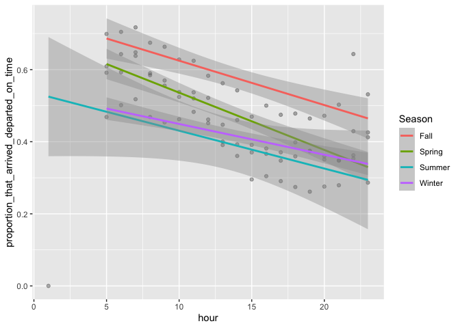
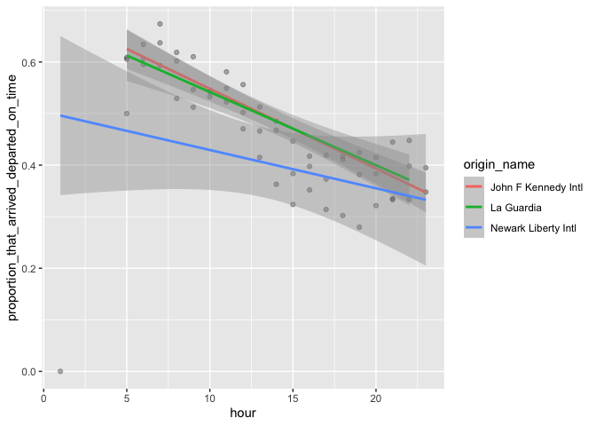
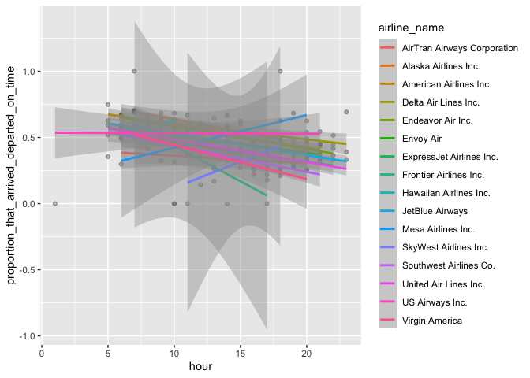

Stat433 hw2
================
Catherine Zheng
2022-10-13

``` r
library(nycflights13)
library(ggplot2)
library(dplyr)
```

Quetsion: What time of day should you fly if you want to avoid delays as
much as possible? Does this choice depend on anything? Season? Weather?
Airport? Airline? Summarize the results and support each finding with
data summaries and visualizations

``` r
flights %>% 
  mutate(on_time = if_else(condition = arr_delay<=0 & dep_delay<=0,
                           true = T,
                           false = F,
                           missing = F)) %>% 
  group_by(hour) %>% 
  summarise(proportion_that_arrived_departed_on_time = mean(on_time), number_of_flights = n()) %>% 
  arrange(desc(proportion_that_arrived_departed_on_time))
```

    ## # A tibble: 20 × 3
    ##     hour proportion_that_arrived_departed_on_time number_of_flights
    ##    <dbl>                                    <dbl>             <int>
    ##  1     7                                    0.632             22821
    ##  2     6                                    0.611             25951
    ##  3     5                                    0.590              1953
    ##  4     8                                    0.582             27242
    ##  5     9                                    0.561             20312
    ##  6    11                                    0.542             16033
    ##  7    10                                    0.541             16708
    ##  8    12                                    0.505             18181
    ##  9    13                                    0.453             19956
    ## 10    22                                    0.441              2639
    ## 11    14                                    0.439             21706
    ## 12    23                                    0.394              1061
    ## 13    16                                    0.390             23002
    ## 14    15                                    0.380             23888
    ## 15    18                                    0.378             21783
    ## 16    17                                    0.369             24426
    ## 17    19                                    0.367             21441
    ## 18    21                                    0.365             10933
    ## 19    20                                    0.364             16739
    ## 20     1                                    0                     1

From the above proportion, it seems that 7am in the day is the best time
to fly in order to avoid both arrival delay and departure delays.

A. Season

Based on common sense, I make Spring (month 3-5), Summer(month 6-8),
Fall(9-11), Winter(month 12-2).

``` r
Season <- tibble(key = c(1:12), Season = c(rep("Winter",2),rep("Spring",3),rep("Summer",3),rep("Fall",3),"Winter"))
flights2 <- flights %>% left_join(Season,by=c("month" = "key"))
flights2 <- flights2 %>% 
  mutate(on_time = if_else(condition = arr_delay<=0 & dep_delay<=0,
                           true = T,
                           false = F,
                           missing = F)) %>% 
  group_by(Season,hour) %>% 
  summarise(proportion_that_arrived_departed_on_time = mean(on_time), number_of_flights = n()) %>% 
  arrange(desc(proportion_that_arrived_departed_on_time))
flights2
```

    ## # A tibble: 77 × 4
    ## # Groups:   Season [4]
    ##    Season  hour proportion_that_arrived_departed_on_time number_of_flights
    ##    <chr>  <dbl>                                    <dbl>             <int>
    ##  1 Fall       7                                    0.717              5754
    ##  2 Fall       6                                    0.705              6149
    ##  3 Fall       5                                    0.699               455
    ##  4 Fall       8                                    0.675              7293
    ##  5 Fall       9                                    0.663              4863
    ##  6 Spring     7                                    0.648              5677
    ##  7 Fall      22                                    0.643               597
    ##  8 Spring     6                                    0.643              6716
    ##  9 Summer     7                                    0.638              5972
    ## 10 Fall      10                                    0.628              4403
    ## # … with 67 more rows

``` r
season_plot <- ggplot(data = flights2,
             mapping = aes(x = hour,
                           y = proportion_that_arrived_departed_on_time))
season_plot + geom_point(alpha = 0.3) +
  geom_smooth(method = "lm", aes(color = Season)) 
```

<!-- -->

From the plot, we can see that Fall has the highest proportion of
flights that both arriving and departuring on time. Then Spring has the
second highest proportion and Summer is the lowest. Meanwhile, it
appears that the early hours in day has less delays than later in the
day in all seasons.

B. Airport

Based on the origin, there are only three airports in nyc, which are
EWR, LGA, and JFK. So we are grouping by the origin and hour to see
which time of the day in which airport has least proportion of delays
(a.k.a the highest proportion of arriving or departuring on time)

``` r
flights3 <- flights %>% left_join(airports, by = c("origin"="faa"))
origin_hour <- flights3 %>% 
  mutate(on_time = if_else(condition = arr_delay<=0 & dep_delay<=0,
                           true = T,
                           false = F,
                           missing = F), origin_name = name) %>% 
  group_by(origin_name,hour) %>% 
  summarise(proportion_that_arrived_departed_on_time = mean(on_time), number_of_flights = n()) %>% 
  arrange(desc(proportion_that_arrived_departed_on_time),desc(number_of_flights))
origin_hour
```

    ## # A tibble: 57 × 4
    ## # Groups:   origin_name [3]
    ##    origin_name          hour proportion_that_arrived_departed_on_time number_o…¹
    ##    <chr>               <dbl>                                    <dbl>      <int>
    ##  1 La Guardia              7                                    0.674       7137
    ##  2 John F Kennedy Intl     7                                    0.637       7026
    ##  3 La Guardia              6                                    0.634       8558
    ##  4 La Guardia              8                                    0.619       7167
    ##  5 La Guardia              9                                    0.610       7760
    ##  6 Newark Liberty Intl     5                                    0.609        895
    ##  7 John F Kennedy Intl     6                                    0.607       6260
    ##  8 John F Kennedy Intl     5                                    0.605        750
    ##  9 John F Kennedy Intl     8                                    0.602      10780
    ## 10 Newark Liberty Intl     6                                    0.595      11133
    ## # … with 47 more rows, and abbreviated variable name ¹​number_of_flights

``` r
origin_hour_plot <- ggplot(data = origin_hour,
             mapping = aes(x = hour,
                           y = proportion_that_arrived_departed_on_time))
origin_hour_plot + geom_point(alpha = 0.3) +
  geom_smooth(method = "lm", aes(color = origin_name)) 
```

<!-- -->

From the above plot, we can see that Newrk Liberty Intl(EWR) tends to
have more delays than the other two airports. John F Kennedy Intl (JFK)
seems to have less delays from early morning (5am) to noon (12pm) and La
Guardia (LGA) tends to have less delays from afternoon (3pm) to night
(10pm).

C.Airline

Based on the carriers, there are 16 different carriers and I used that
to group with the hour of the day to see if there is any interesting
pattern.

``` r
flights4 <- flights %>% left_join(airlines, by = c("carrier"="carrier"))
airline_hour <- flights4 %>% 
  mutate(on_time = if_else(condition = arr_delay<=0 & dep_delay<=0,
                           true = T,
                           false = F,
                           missing = F), airline_name = name) %>% 
  group_by(airline_name,hour) %>% 
  summarise(proportion_that_arrived_departed_on_time = mean(on_time), number_of_flights = n()) %>% 
  arrange(desc(proportion_that_arrived_departed_on_time),desc(number_of_flights))
airline_hour
```

    ## # A tibble: 207 × 4
    ## # Groups:   airline_name [16]
    ##    airline_name            hour proportion_that_arrived_departed_on_time numbe…¹
    ##    <chr>                  <dbl>                                    <dbl>   <int>
    ##  1 Frontier Airlines Inc.     7                                    1           1
    ##  2 Mesa Airlines Inc.        18                                    1           1
    ##  3 US Airways Inc.            5                                    0.748     341
    ##  4 Delta Air Lines Inc.       7                                    0.706    3787
    ##  5 US Airways Inc.            7                                    0.701     912
    ##  6 Endeavor Air Inc.          7                                    0.696     628
    ##  7 Alaska Airlines Inc.       7                                    0.693     349
    ##  8 Delta Air Lines Inc.      23                                    0.692      13
    ##  9 American Airlines Inc.     7                                    0.690    3348
    ## 10 Mesa Airlines Inc.        19                                    0.684      19
    ## # … with 197 more rows, and abbreviated variable name ¹​number_of_flights

``` r
airline_hour_plot <- ggplot(data = airline_hour,
             mapping = aes(x = hour,
                           y = proportion_that_arrived_departed_on_time))
airline_hour_plot + geom_point(alpha = 0.3) +
  geom_smooth(method = "lm", aes(color = airline_name),na.rm = TRUE) 
```

<!-- -->

From the plot, US Airways Inc. appears to have less delays overall in
all days. Most of the airlines have less delays in the daytime and more
delays at nights (showed by the negative slope of some lines). Some
airlines like SkyWest Airlines and Mesa Airlines Inc.tends to have less
delays from noon to night and more delays from morning to noon.
